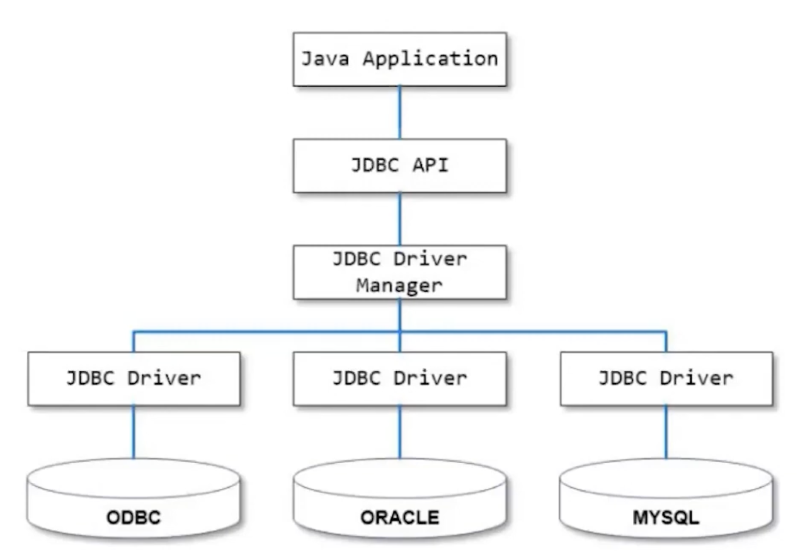
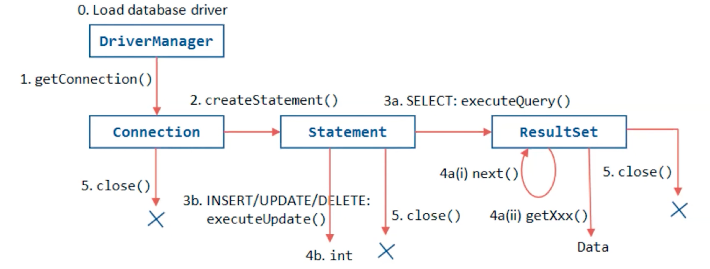

# 데이터베이스 드라이버

## 드라이버 역할 및 종류

드라이버의 역할: DB 드라이버는 애플리케이션과 DB간의 통신을 중개하는 역할을 수행.
드라이버의 종류: Oracle, MySQL, PostgreSQL 등 RDBMS에 호환되는 드라이버가 종류 별로 나뉜다.

## 드라이버의 동작 방식
1. **연결 초기화**
    - **요청 수신:** 애플리케이션은 데이터베이스 작업을 시작하기 위해 드라이버에 연결을 요청합니다. 이는 마치 항공편✈️ 이 이륙 허가를 받기 위해 관제탑에 요청하는 것과 유사합니다.
    - **연결 설정:** 드라이버는 데이터베이스 서버에 로그인하고 필요한 설정을 수행하여 연결을 완료합니다. 이 과정은 네트워크 정보, 인증 자격 증명 등을 사용하여 이루어집니다.
2. **SQL 전송 및 실행**
    - **SQL 명령 변환:** 애플리케이션에서 발송된 SQL 명령을 받은 드라이버는 해당 명령을 데이터베이스가 이해할 수 있는 형태로 변환합니다. 이는 외국어를 현지 언어로 번역하는 통역사의 역할과 같습니다.
    - **명령 처리:** 변환된 명령은 데이터베이스 서버로 전송되어 실행됩니다. 데이터베이스는 쿼리를 처리하고, 요구된 데이터를 검색하거나 데이터에 변화를 줍니다.
3. **결과 처리**
    - **결과 수신:** 데이터베이스에서 작업의 결과를 보내면, 드라이버는 이 결과를 받아 애플리케이션에서 해석할 수 있는 형태로 변환합니다.
    - **결과 전달:** 최종적으로, 드라이버는 이 결과를 애플리케이션에 전달합니다. 이는 관제탑이 항공기✈️에 착륙 지시를 내리는 과정과 유사하며, 애플리케이션은 이 정보를 사용자에게 표시하거나 다음 작업을 진행합니다.
4. **연결 종료**
    - **연결 해제:** 작업이 완료되면, 드라이버는 데이터베이스 서버와의 연결을 종료합니다. 이는 비행이 끝난 후 항공기✈️가 공항 게이트에 도킹하는 것과 비슷하며, 자원을 정리하고 다음 세션을 위해 시스템을 초기화합니다.

>JDBC Driver Manager는 애플리케이션이 실행되고 있는 런타임 시점에
>- Connection을 생성하여 쿼리를 요청할 수 있는 상태를 만들어주고
>- Statement를 생성하여 쿼리르 요청하게 해주고
>- ResultSet을 생성해 쿼리 결과를 받아올 수 있게 해준다.
>

#### PreparedStatement
- statement와 다른점
state

PreparedStatement는 내부적으로 Statement의 4단계(구문분석, 치환, 실행, 인출) 과정 중 첫 번째 parse 과정의 결과를 캐싱하고, 나머지 3가지 단계만 거쳐서 SQL문이 실행될 수 있게 합니다.