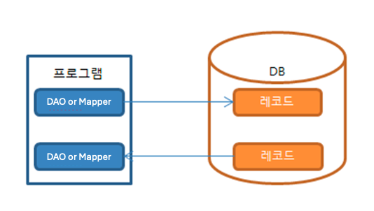
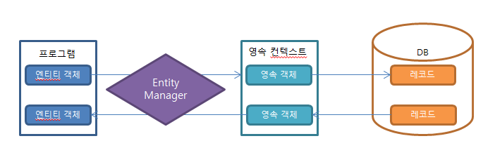
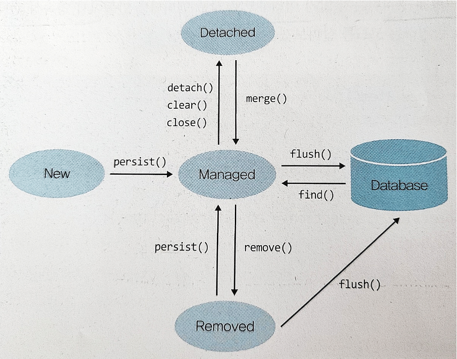

## 쿼리코드 만들기 JpaRepository

QueryMapper의 DB의존성 및 중복 쿼리 문제로 ORM이 탄생

### 문제점
#### 상속의 문제
- **객체:** 객체간에 맴버변수나 상속관계를 맺을 수 있다.
- **RDB:** 테이블들은 상속관계가 없고 모두 독립적으로 존재한다.
>해결방법 : 매핑정보에 상속정보를 넣어준다. (`@OneToMany` `@ManyToOne`)
#### 관계 문제
- **객체:** 참조를 통해 관계를 가지며 방향을 가진다. (N:M 관계 포함)
- **RDB:** FK를 설정하여 Join으로 조회시에만 참조가 가능
>해결방법 : 매핑정보에 방향정보를 넣어준다. (`@JoinColumn` `@MappedBy`)
#### 탐색 문제
- **객체:** 참조를 통해 다른 객체로 순차적 탐색이 가능하며 콜랙션도 순회한다.
- **RDB:** 탐색 시 참조하는 만큼 추가 쿼리나, Join이 발생하여 비효율적이다.
>해결방법 : 매핑/조회 정보로 참조탐색 시점을 관리한다.(`@FetchType` `fetchJoin()`)

#### 밀도 문제
- **객체:** 맴버 객체 크기가 매우 클 수 있다.
- **RDB:** 기본 데이터 타입만 존재한다.
>해결방법 : 크기가 큰 멤버 객체는 테이블을 분리하여 상속으로 처리한다. (`@embedded`)

#### 식별성 문제
- **객체:** 객체의 hashCode 또는 정의한 `equals()` 메서드를 통해 식별
- **RDB:** PK로만 식별
>해결방법 : PK 를 객체 Id로 설정하고 EntityManager는 해당 값으로 객체를 식별하여 관리 한다.(`@Id` `@GeneratedValue`)

### 해결책
영속성 컨텍스트(1차 캐시)를 활용한 쓰기지연
#### 영속성이란?
- 데이터를 생성한 프로그램이 종료되어도 사라지지 않는 데이터의 특성을 말한다.
- 영속성을 갖지 않으면 데이터는 메모리에서만 존재하게 되고 프로그램이 종료되면 해당 데이터는 모두 사라지게 된다.
- 그래서 우리는 데이터를 파일이나 DB에 영구 저장함으로써 데이터에 영속성을 부여한다.

#### 영속성의 4가지 상태
1.  비영속(new/transient) - 엔티티 객체가 만들어져서 아직 저장되지 않은 상태로, 영속성컨텍스트와 전혀 관계가 없는 상태
2. 영속(managed) - 엔티티가 영속성 컨텍스트에 저장되어, 영속성 컨텍스트가 관리할 수 있는 상태
3. 준영속(detached) - 엔티티가 영속성 컨텍스트에 저장되어 있다가 분리된 상태로, 영속성컨텍스트가 더 이상 관리하지 않는 상태
4. 삭제(removed) - 엔티티를 영속성 컨텍스트와 데이터베이스에서 삭제하겠다고 표시한 상태
   - 객체의 영속성 상태는 Entity Manager 의 메소드를 통해 전환된다.
   - 💁‍♂️ Raw JPA 관점에서 순서대로 요약정리 해보자면
     - new > `(비영속상태)` > persist(),merge() > (영속성 컨텍스트에 저장된 상태) > flush()  > (DB에 쿼리가 전송된 상태) >  commit() > (DB에 쿼리가 반영된 상태)

- **쓰기 지연이 발생하는 시점**
    - flush() 동작이 발생하기 전까지 최적화한다.
    - flush() 동작으로 전송된 쿼리는 더이상 쿼리 최적화는 되지 않고, 이후 commit()으로 반영만 가능하다.
- **쓰기 지연 효과**
  - 여러개의 객체를 생성할 경우 모아서 한번에 쿼리를 전송한다.
  - 영속성 상태의 객체가 생성 및 수정이 여러번 일어나더라도 해당 트랜잭션 종료시 쿼리는 1번만 전송될 수 있다.
  - 영속성 상태에서 객체가 생성되었다 삭제되었다면 실제 DB에는 아무 동작이 전송되지 않을 수 있다.
  - 즉, 여러가지 동작이 많이 발생하더라도 쿼리는 트랜잭션당 최적화 되어 최소쿼리만 날라가게된다.